# GetStarted

You can use the [MXChip IoT DevKit](https://microsoft.github.io/azure-iot-developer-kit/) to develop and prototype Internet of Things (IoT) solutions that take advantage of Microsoft Azure services. It includes an Arduino-compatible board with rich peripherals and sensors, an open-source board package, and a rich [sample gallery](https://microsoft.github.io/azure-iot-developer-kit/docs/projects/).

## What you learn

* How to create an IoT hub and register a device for the MXChip IoT DevKit.
* How to connect the IoT DevKit to Wi-Fi and configure the IoT Hub connection string.
* How to send the DevKit sensor telemetry data to your IoT hub.
* How to prepare the development environment and develop application for the IoT DevKit.

Don't have a DevKit yet? Try the [DevKit simulator](https://azure-samples.github.io/iot-devkit-web-simulator/) or [purchase a DevKit](https://aka.ms/iot-devkit-purchase).

You can find the source code for all DevKit tutorials at the [IoTDevEnvExamples](https://github.com/IoTDevEnvExamples) repository.

## What you need

* A MXChip IoT DevKit board with a Micro-USB cable. [Get it now](https://aka.ms/iot-devkit-purchase).
* A computer running Windows 10, macOS 10.10+ or Ubuntu 18.04+.
* An active Azure subscription. [Activate a free 30-day trial Microsoft Azure account](https://azureinfo.microsoft.com/us-freetrial.html).

## Use Azure Cloud Shell

Azure hosts Azure Cloud Shell, an interactive shell environment that you can use through your browser. Cloud Shell lets you use either `bash` or `PowerShell` to work with Azure services. You can use the Cloud Shell pre-installed commands to run the code in this article without having to install anything on your local environment.

To launch Azure Cloud Shell:

| Option | Example/Link |
|-----------------------------------------------|---|
| Select **Try It** in the upper-right corner of a code block. Selecting **Try It** doesn't automatically copy the code to Cloud Shell. |  |
| Go to [https://shell.azure.com](https://shell.azure.com) or select the **Launch Cloud Shell** button to open Cloud Shell in your browser. | [](https://shell.azure.com) |
| Select the **Cloud Shell** button on the top-right menu bar in the [Azure portal](https://portal.azure.com). |  |

To run the code in this article in Azure Cloud Shell:

1. Launch Cloud Shell.

2. Select the **Copy** button on a code block to copy the code.

3. Paste the code into the Cloud Shell session with **Ctrl**+**Shift**+**V** on Windows and Linux, or **Cmd**+**Shift**+**V** on macOS.

4. Press **Enter** to run the code.
  
## Prepare your hardware

Hook up the following hardware to your computer:

* DevKit board
* Micro-USB cable


To connect the DevKit to your computer, follow these steps:

1. Connect the USB end to your computer.

2. Connect the Micro-USB end to the DevKit.

3. The green LED for power confirms the connection.

   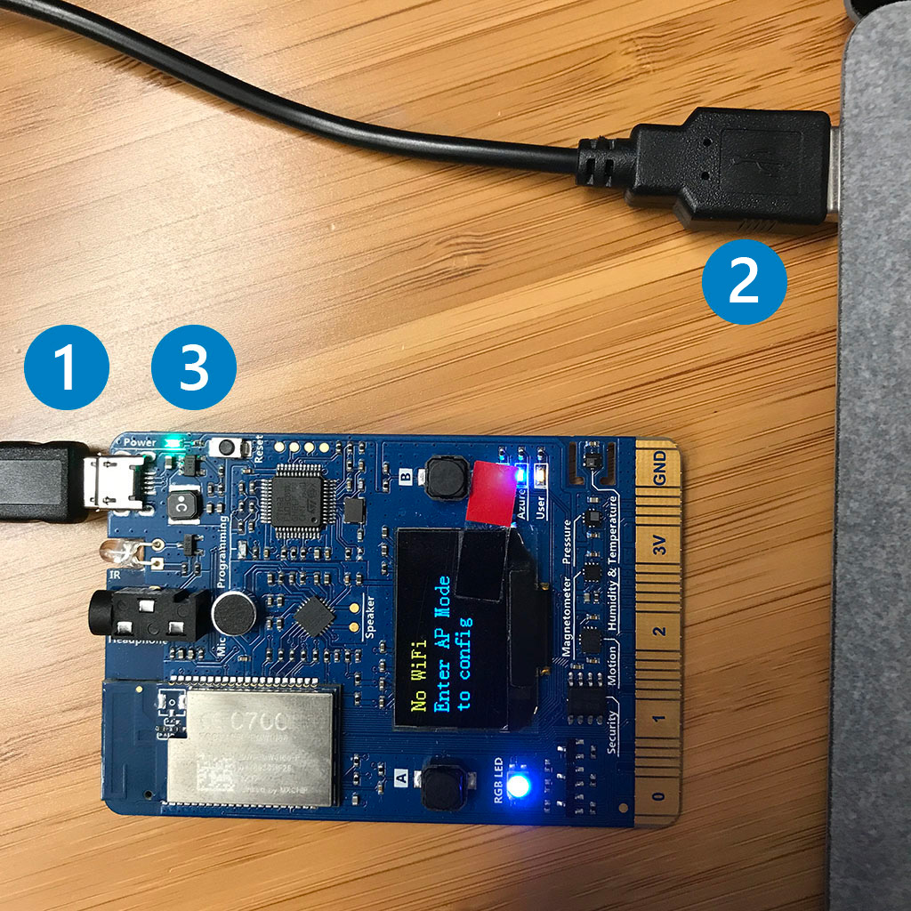

## Quickstart: Send telemetry from DevKit to an IoT Hub

The quickstart uses pre-compiled DevKit firmware to send the telemetry to the IoT Hub. Before you run it, you create an IoT hub and register a device with the hub.

### Create an IoT hub

This section describes how to create an IoT hub using the [Azure portal](https://portal.azure.com).

1. Sign in to the [Azure portal](https://portal.azure.com).

2. Choose **Create a resource**, and then enter *IoT Hub* in the **Search the Marketplace** field.

3. Select **IoT Hub** from the search results, and then select **Create**.

4. On the **Basics** tab, complete the fields as follows:

   - **Subscription**: Select the subscription to use for your hub.

   - **Resource Group**: Select a resource group or create a new one. To create a new one, select **Create new** and fill in the name you want to use. To use an existing resource group, select that resource group. For more information, see [Manage Azure Resource Manager resource groups](https://docs.microsoft.com/en-us/azure/azure-resource-manager/manage-resource-groups-portal).

   - **Region**: Select the region in which you want your hub to be located. Select the location closest to you.

   - **IoT Hub Name**: Enter a name for your hub. This name must be globally unique. If the name you enter is available, a green check mark appears.

   > [IMPORTANT] 
   > Because the IoT hub will be publicly discoverable as a DNS endpoint, be sure to avoid entering any sensitive or personally identifiable information when you name it.

   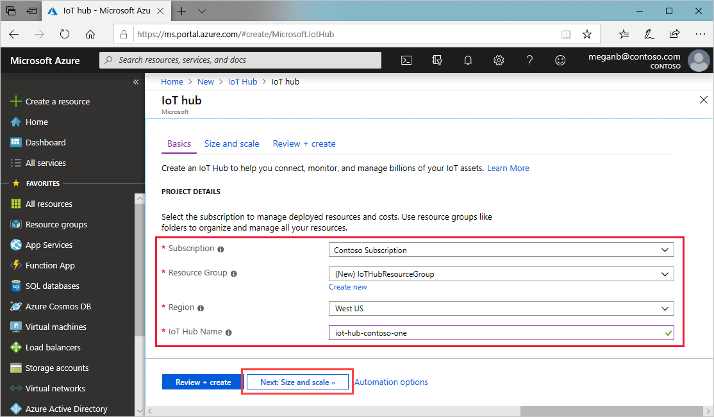

5. Select **Next: Size and scale** to continue creating your hub.

   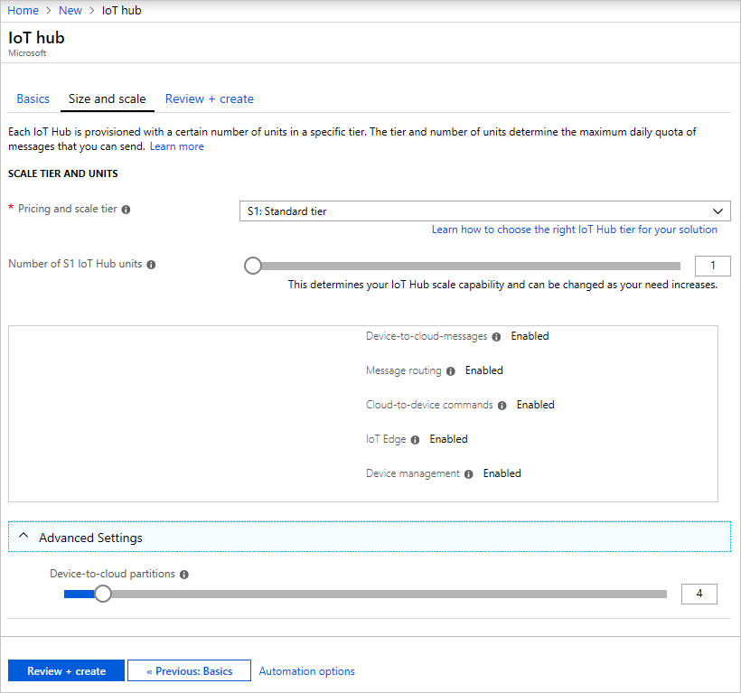

    This screen allows you to set the following values:

    - **Pricing and scale tier**: Your selected tier. You can choose from several tiers, depending on how many features you want and how many messages you send through your solution per day. The free tier is intended for testing and evaluation. It allows 500 devices to be connected to the hub and up to 8,000 messages per day. Each Azure subscription can create one IoT Hub in the free tier.

    - **IoT Hub units**: The number of messages allowed per unit per day depends on your hub's pricing tier. For example, if you want the hub to support ingress of 700,000 messages, you choose two S1 tier units.
    For details about the other tier options, see [Choosing the right IoT Hub tier](https://docs.microsoft.com/en-us/azure/iot-hub/iot-hub-scaling).

    - **Advanced Settings** > **Device-to-cloud partitions**: This property relates the device-to-cloud messages to the number of simultaneous readers of the messages. Most hubs need only four partitions.

6. For this tutorial, accept the default choices, and then select **Review + create** to review your choices. You see something similar to this screen.

   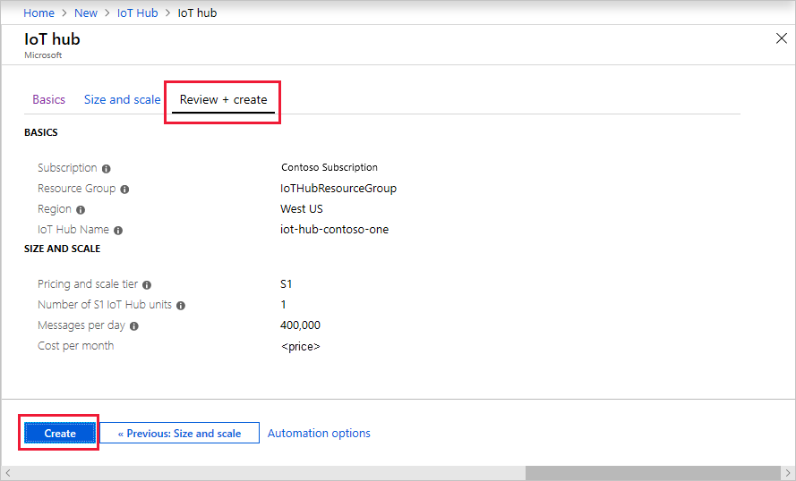

7. Select **Create** to create your new hub. Creating the hub takes a few minutes.

### Register a device

A device must be registered with your IoT hub before it can connect. In this quickstart, you use the Azure Cloud Shell to register a simulated device.

1. Run the following command in Azure Cloud Shell to create the device identity.

   **YourIoTHubName**: Replace this placeholder below with the name you choose for your IoT hub.

   **MyNodeDevice**: The name of the device you're registering. Use **MyNodeDevice** as shown. If you choose a different name for your device, you need to use that name throughout this article, and update the device name in the sample applications before you run them.

    ```azurecli-interactive
    az iot hub device-identity create --hub-name YourIoTHubName --device-id MyNodeDevice
    ```

   > [NOTE]
   > If you get an error running `device-identity`, install the [Azure IOT Extension for Azure CLI](https://github.com/Azure/azure-iot-cli-extension/blob/dev/README.md) for more details.
  
2. Run the following commands in Azure Cloud Shell to get the _device connection string_ for the device you just registered:

   **YourIoTHubName**: Replace this placeholder below with the name you choose for your IoT hub.

    ```azurecli-interactive
    az iot hub device-identity show-connection-string --hub-name YourIoTHubName --device-id MyNodeDevice --output table
    ```

    Make a note of the device connection string, which looks like:

   `HostName={YourIoTHubName}.azure-devices.net;DeviceId=MyNodeDevice;SharedAccessKey={YourSharedAccessKey}`

    You use this value later in the quickstart.

### Send DevKit telemetry

The DevKit connects to a device-specific endpoint on your IoT hub and sends temperature and humidity telemetry.

1. Download the latest version of [GetStarted firmware](https://aka.ms/devkit/prod/getstarted/latest) for IoT DevKit.

2. Make sure IoT DevKit connect to your computer via USB. Open File Explorer there is a USB mass storage device called **AZ3166**.

    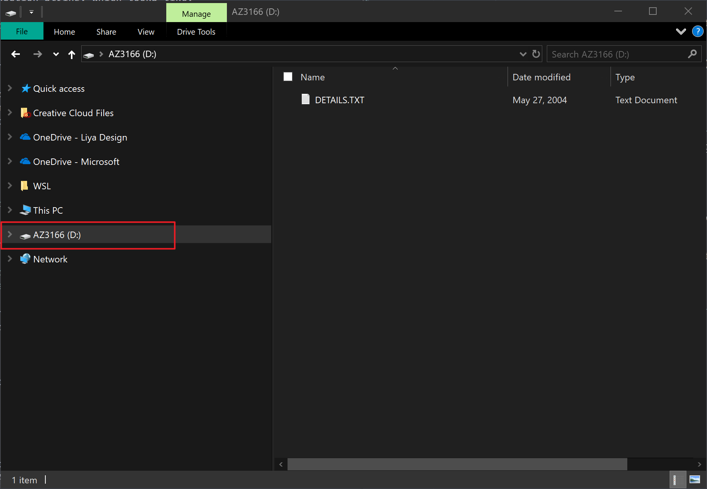

3. Drag and drop the firmware just downloaded into the mass storage device and it will flash automatically.

    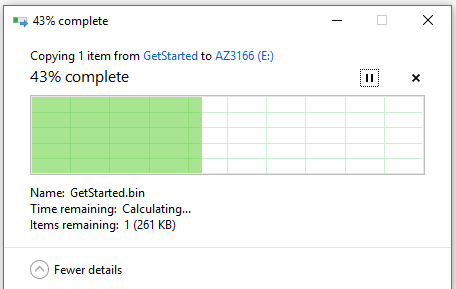

4. On the DevKit, Hold down button **B**, push and release the **Reset** button, and then release button **B**. Your DevKit enters AP mode. To confirm, the screen displays the service set identifier (SSID) of the DevKit and the configuration portal IP address.

    

    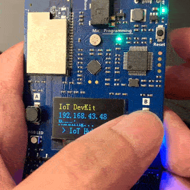

5. Use a Web browser on a different Wi-Fi enabled device (computer or mobile phone) to connect to the IoT DevKit SSID displayed in the previous step. If it asks for a password, leave it empty.

    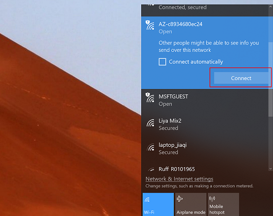

6. Open **192.168.0.1** in the browser. Select the Wi-Fi that you want the IoT DevKit connect to, type the Wi-Fi password, then paste the device connection string you made note of previously. Then click Save.

    

    > [NOTE]
    > The IoT DevKit only supports 2.4GHz network. Check [FAQ](https://microsoft.github.io/azure-iot-developer-kit/docs/faq/#wi-fi-configuration) for more details.

7. The WiFi information and device connection string will be stored into the IoT DevKit when you see the result page.

    

    > [NOTE]
    > After Wi-Fi is configured, your credentials will persist on the device for that connection, even if the device is unplugged.

8. The IoT DevKit reboots in a few seconds. On the DevKit screen, you see the IP address for the DevKit follows by the telemetry data including temperature and humidity value with message count send to Azure IoT Hub.

    

    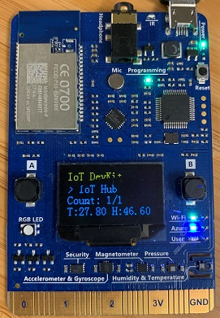

9. To verify the telemetry data sent to Azure, run the following command in Azure Cloud Shell:

    ```bash
    az iot hub monitor-events --hub-name YourIoTHubName --output table
    ```

## Prepare the development environment

Follow these steps to prepare the development environment for the DevKit:

### Install Visual Studio Code with Azure IoT Tools extension package

1. Install [Arduino IDE](https://www.arduino.cc/en/Main/Software). It provides the necessary toolchain for compiling and uploading Arduino code.
    * **Windows**: Use Windows Installer version. Do not install from the App Store.
    * **macOS**: Drag and drop the extracted **Arduino.app** into `/Applications` folder.
    * **Ubuntu**: Unzip it into folder such as `$HOME/Downloads/arduino-1.8.8`

2. Install [Visual Studio Code](https://code.visualstudio.com/), a cross platform source code editor with powerful intellisense, code completion and debugging support as well as rich extensions can be installed from marketplace.

3. Launch VS Code, look for **Arduino** in the extension marketplace and install it. This extension provides enhanced experiences for developing on Arduino platform.

    

4. Look for [Azure IoT Tools](https://aka.ms/azure-iot-tools) in the extension marketplace and install it.

    

    > [NOTE]
    > The Azure IoT Tools extension pack contains the [Azure IoT Device Workbench](https://aka.ms/iot-workbench) which is used to develop and debug on various IoT devkit devices. The [Azure IoT Hub Toolkit](https://aka.ms/iot-toolkit), also included with the Azure IoT Tools extension pack, is used to manage and interact with Azure IoT Hubs.

5. Configure VS Code with Arduino settings.

    In Visual Studio Code, click **File > Preference > Settings**. Then click the **...** and **Open settings.json**.

    

    Add following lines to configure Arduino depending on your platform: 

    * **Windows**:

        ```json
        "arduino.path": "C:\\Program Files (x86)\\Arduino",
        "arduino.additionalUrls": "https://raw.githubusercontent.com/VSChina/azureiotdevkit_tools/master/package_azureboard_index.json"
        ```

    * **macOS**:

        ```json
        "arduino.path": "/Applications",
        "arduino.additionalUrls": "https://raw.githubusercontent.com/VSChina/azureiotdevkit_tools/master/package_azureboard_index.json"
        ```

    * **Ubuntu**:

        Replace the **{username}** placeholder below with your username.

        ```json
        "arduino.path": "/home/{username}/Downloads/arduino-1.8.8",
        "arduino.additionalUrls": "https://raw.githubusercontent.com/VSChina/azureiotdevkit_tools/master/package_azureboard_index.json"
        ```

6. Click `F1` to open the command palette, type and select **Arduino: Board Manager**. Search for **AZ3166** and install the latest version.

    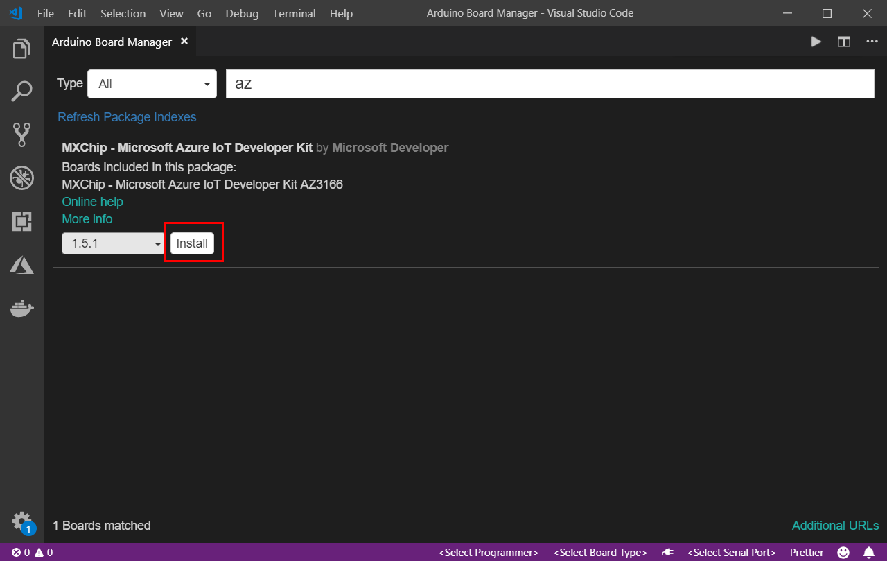

### Install ST-Link drivers

[ST-Link/V2](https://www.st.com/en/development-tools/st-link-v2.html) is the USB interface that IoT DevKit uses to communicate with your development machine. You need to install it on Windows to flash the compiled device code to the DevKit. Follow the OS-specific steps to allow the machine access to your device.

* **Windows**: Download and install USB driver from [STMicroelectronics website](https://www.st.com/en/development-tools/stsw-link009.html).
* **macOS**: No driver is required for macOS.
* **Ubuntu**: Run the commands in terminal and sign out and sign in for the group change to take effect:

    ```bash
    # Copy the default rules. This grants permission to the group 'plugdev'
    sudo cp ~/.arduino15/packages/AZ3166/tools/openocd/0.10.0/linux/contrib/60-openocd.rules /etc/udev/rules.d/
    sudo udevadm control --reload-rules

    # Add yourself to the group 'plugdev'
    # Logout and log back in for the group to take effect
    sudo usermod -a -G plugdev $(whoami)
    ```

Now you are all set with preparing and configuring your development environment. Let us build the GetStarted sample you just ran.

## Build your first project

### Open sample code from sample gallery

The IoT DevKit contains a rich gallery of samples that you can use to learn connect the DevKit to various Azure services.

1. Make sure your IoT DevKit is **not connected** to your computer. Start VS Code first, and then connect the DevKit to your computer.

2. Click `F1` to open the command palette, type and select **Azure IoT Device Workbench: Open Examples...**. Then select **IoT DevKit** as board.

3. In the IoT Workbench Examples page, find **Get Started** and click **Open Sample**. Then selects the default path to download the sample code.

    

### Provision Azure IoT Hub and device

Instead of provisioning Azure IoT Hub and device from the Azure portal, you can do it in the VS Code without leaving the development environment.

1. In the new opened project window, click `F1` to open the command palette, type and select **Azure IoT Device Workbench: Provision Azure Services...**. Follow the step by step guide to finish provisioning your Azure IoT Hub and creating the IoT Hub device.

    

    > [NOTE]
    > If you have not signed in Azure. Follow the pop-up notification for signing in.

2. Select the subscription you want to use.

    

3. Then select or create a new [resource group](https://docs.microsoft.com/azure/azure-resource-manager/resource-group-overview#terminology).

    

4. In the resource group you specified, follow the guide to select or create a new Azure IoT Hub.

    

    

    

5. In the output window, you will see the Azure IoT Hub provisioned.

    

6. Select or create a new device in Azure IoT Hub you provisioned.

    

    

7. Now you have Azure IoT Hub provisioned and device created in it. Also the device connection string will be saved in VS Code for configuring the IoT DevKit later.

    

### Configure and compile device code

1. In the bottom-right status bar, check the **MXCHIP AZ3166** is shown as selected board and serial port with **STMicroelectronics** is used.

    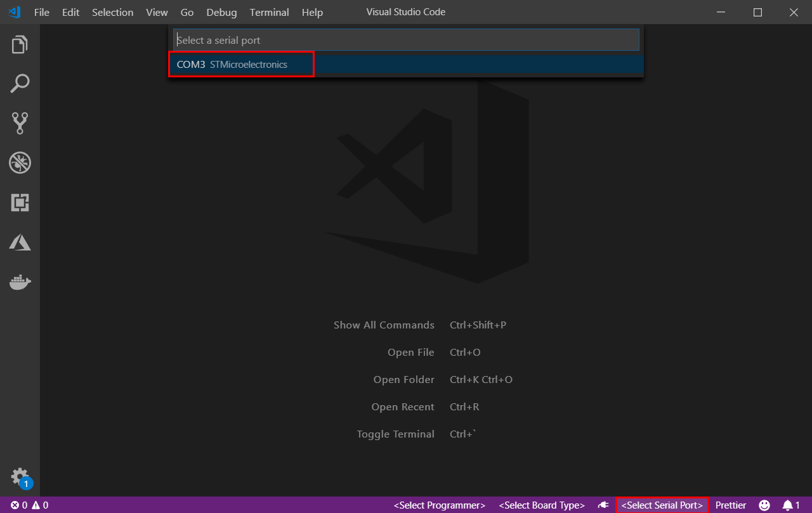

2. Click `F1` to open the command palette, type and select **Azure IoT Device Workbench: Configure Device Settings...**, then select **Config Device Connection String > Select IoT Hub Device Connection String**.

3. On DevKit, hold down **button A**, push and release the **reset** button, and then release **button A**. Your DevKit enters configuration mode and saves the connection string.

    

4. Click `F1` again, type and select **Azure IoT Device Workbench: Upload Device Code**. It starts compile and upload the code to DevKit.

    

The DevKit reboots and starts running the code.

> [NOTE]
> If there is any errors or interruptions, you can always recover by running the command again.

## Test the project

### View the telemetry sent to Azure IoT Hub

Click the power plug icon on the status bar to open the Serial Monitor:


The sample application is running successfully when you see the following results:

* The Serial Monitor displays the message sent to the IoT Hub.
* The LED on the MXChip IoT DevKit is blinking.

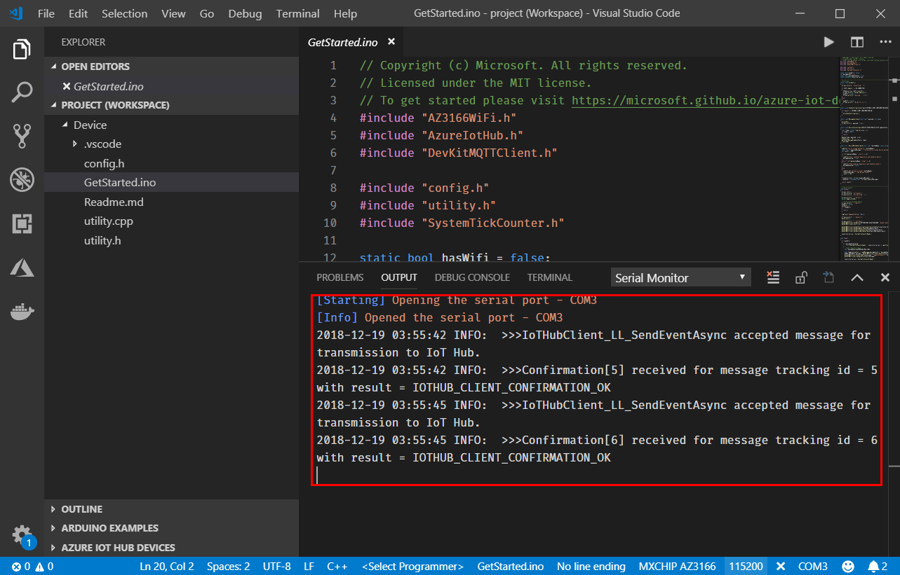

### View the telemetry received by Azure IoT Hub

You can use [Azure IoT Tools](https://marketplace.visualstudio.com/items?itemName=vsciot-vscode.azure-iot-tools) to monitor device-to-cloud (D2C) messages in IoT Hub.

1. Sign in [Azure portal](https://portal.azure.com/), find the IoT Hub you created.

    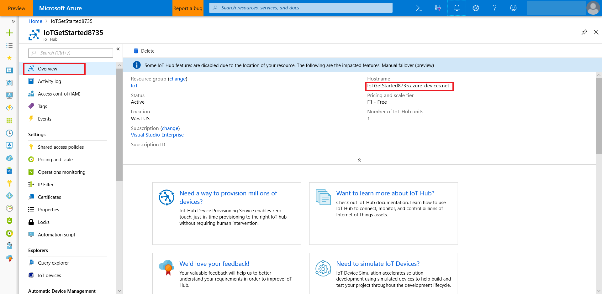

2. In the **Shared access policies** pane, click the **iothubowner policy**, and write down the Connection string of your IoT hub.

    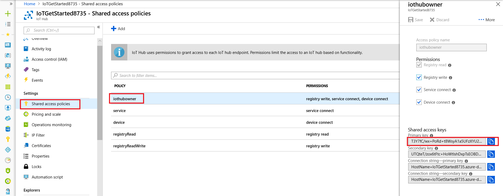

3. In VS Code, click `F1`, type and select **Azure IoT Hub: Set IoT Hub Connection String**. Copy the connection string into it.

    

4. Expand the **AZURE IOT HUB DEVICES** pane on the right, right click on the device name you created and select **Start Monitoring Built-in Event Endpoint**.

    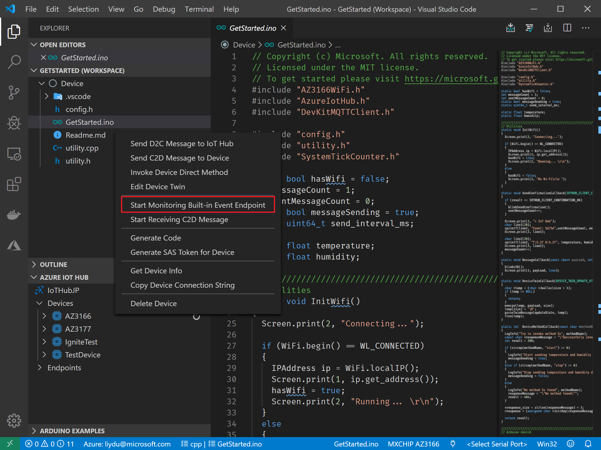

5. In **OUTPUT** pane, you can see the incoming D2C messages to the IoT Hub.

    

## Review the code

The `GetStarted.ino` is the main Arduino sketch file.

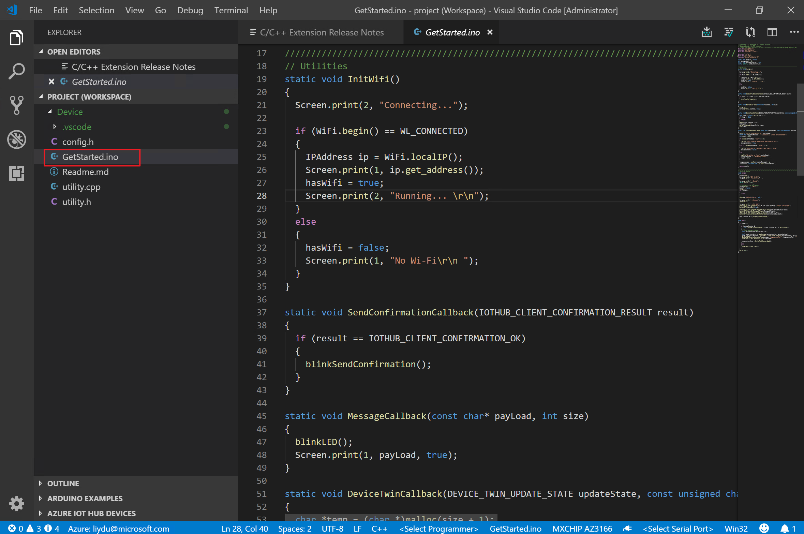

To see how device telemetry is sent to the Azure IoT Hub, open the `utility.cpp` file in the same folder. View [API Reference](https://microsoft.github.io/azure-iot-developer-kit/docs/apis/arduino-language-reference/) to learn how to use sensors and peripherals on IoT DevKit.

The `DevKitMQTTClient` used is a wrapper of the **iothub_client** from the [Microsoft Azure IoT SDKs and libraries for C](https://github.com/Azure/azure-iot-sdk-c/tree/master/iothub_client) to interact with Azure IoT Hub.

## Problems and feedback

If you encounter problems, you can check for a solution in the [IoT DevKit FAQ](https://microsoft.github.io/azure-iot-developer-kit/docs/faq/) or reach out to us from [Gitter](https://gitter.im/Microsoft/azure-iot-developer-kit). You can also give us feedback by leaving a comment on this page.

## Next steps

You have successfully connected an MXChip IoT DevKit to your IoT hub, and you have sent the captured sensor data to your IoT hub.

To continue to get started with Azure IoT Hub and to explore other IoT scenarios using IoT DevKit, see the following:

- [Connect IoT DevKit to your Azure IoT Central application](https://docs.microsoft.com/en-us/azure/iot-central/howto-connect-devkit)
- [Connect IoT DevKit to Azure IoT Remote Monitoring solution accelerator](https://docs.microsoft.com/en-us/azure/iot-accelerators/iot-accelerators-arduino-iot-devkit-az3166-devkit-remote-monitoring-v2)
- [Translate voice message with Azure Cognitive Services](https://docs.microsoft.com/en-us/azure/iot-hub/iot-hub-arduino-iot-devkit-az3166-translator)
- [Retrieve a Twitter message with Azure Functions](https://docs.microsoft.com/en-us/azure/iot-hub/iot-hub-arduino-iot-devkit-az3166-retrieve-twitter-message)
- [Send messages to an MQTT server using Eclipse Paho APIs](https://docs.microsoft.com/en-us/azure/iot-hub/iot-hub-arduino-iot-devkit-az3166-mqtt-helloworld)
- [Monitor the magnetic sensor and send email notifications with Azure Functions](https://docs.microsoft.com/en-us/azure/iot-hub/iot-hub-arduino-iot-devkit-az3166-door-monitor)